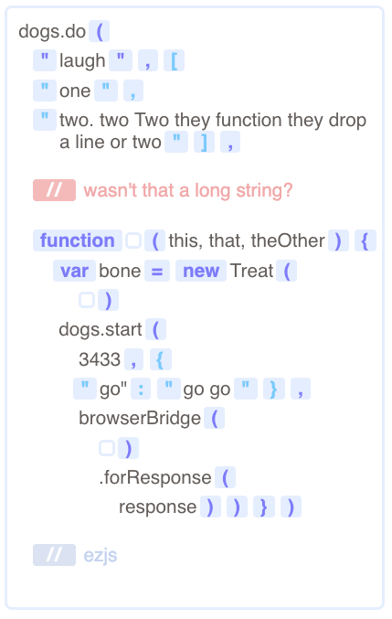

**render-code** takes a carefully formatted subset of JavaScript and renders it as HTML with various symbols and indentation rendered.

### Demo

```javascript
var renderCode = require("./render-code")
var WebSite = require("web-site")
var BrowserBridge = require("browser-bridge")

function demo(arg1, arg2) {
  doSomethingWith(
    "string parameter",[
    "array item 1",
    "array item 2"])
  var thing = new Thing(
    )
  thing.method(
    3003,{
    "key": "value"},
    anotherFunction(
      ).chained(
        toMe))}

var lines = demo.toString().split(/\n/)

var site = new WebSite()
site.start(3003)

site.addRoute(
  "get",
  "/",
  function(request, response) {
    var bridge = new BrowserBridge()
      .forResponse(response)
    renderCode(
      bridge,
      lines)})
```

### Screenshot


